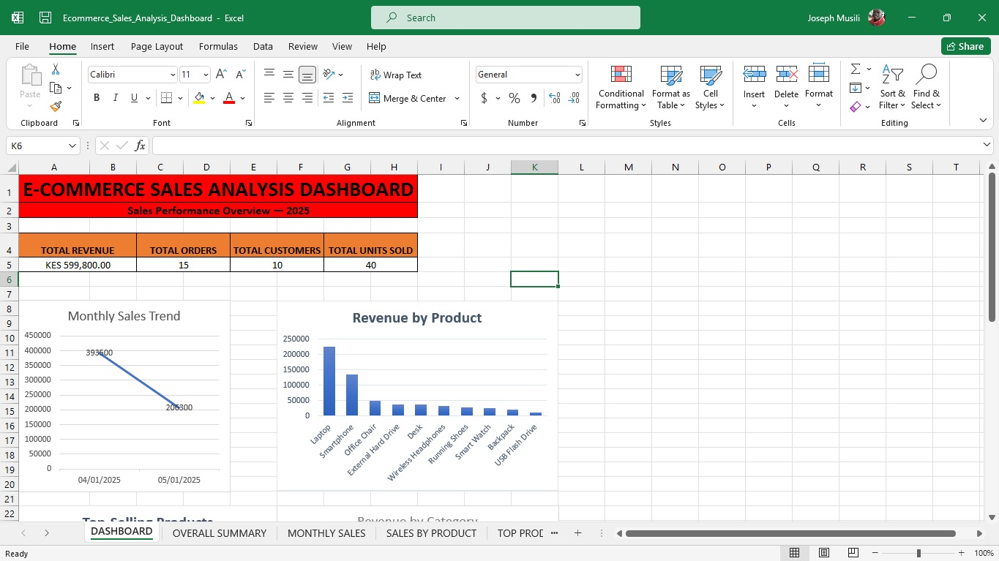
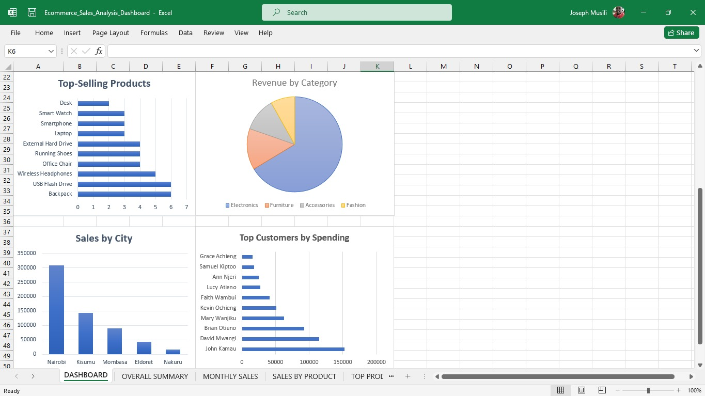

# E-Commerce Sales Analysis

## 📌 Project Overview

This project is an end-to-end E-Commerce Sales Analysis project developed using MySQL, SQL, DBeaver, and Microsoft Excel.

The project uses a relational e-commerce database containing customers, products, orders, and order-item data. SQL was used to extract, transform, and analyse the data, while Microsoft Excel was used to create an interactive sales dashboard and visualize key business insights.

The project demonstrates practical skills in SQL querying, relational database management, data analysis, data aggregation, and business intelligence reporting.

---

## 🎯 Project Objectives

The main objectives of this project were to:

- Analyse e-commerce sales performance
- Calculate total revenue and units sold
- Identify top-selling products
- Identify products generating the most revenue
- Analyse customer purchasing behaviour
- Compare sales performance across cities
- Analyse monthly sales trends
- Analyse revenue by product category
- Identify high-value orders and customers
- Present key findings through an Excel dashboard

---

## 🛠️ Tools and Technologies

- **MySQL** — Database creation and SQL analysis
- **SQL** — Data extraction, aggregation, filtering, and analysis
- **DBeaver** — Database management and query execution
- **Microsoft Excel** — Data visualization and dashboard development
- **GitHub** — Project documentation and version control

---

## 🗄️ Database Structure

The project contains four relational tables:

### Customers

Contains customer information such as:

- Customer ID
- Customer name
- Email
- City
- Registration date

### Products

Contains product information such as:

- Product ID
- Product name
- Category
- Price

### Orders

Contains:

- Order ID
- Customer ID
- Order date

### Order Items

Contains:

- Order item ID
- Order ID
- Product ID
- Quantity
- Price

The tables are connected using primary and foreign keys to maintain relationships between customers, orders, products, and order items.

---

## 🔍 SQL Analysis

The project contains 20 SQL analysis questions covering:

1. Total revenue
2. Top-selling products
3. Products generating the most revenue
4. Top customers by spending
5. Sales by city
6. Monthly sales trends
7. Revenue by product category
8. Customers with more than one order
9. Average order value
10. Customers with no orders
11. Products that have never been sold
12. Units sold by category
13. Customer with the largest single order
14. Revenue percentage by product
15. Day with the highest sales
16. Customer with the most orders
17. Average product price by category
18. Average units purchased per order
19. Top 5 highest-value orders
20. Overall sales summary

The SQL analysis demonstrates the use of:

- SELECT
- JOIN
- LEFT JOIN
- GROUP BY
- HAVING
- ORDER BY
- WHERE
- Aggregate functions
- Subqueries
- DATE_FORMAT
- LIMIT
- DISTINCT
- Calculated fields

---

## 📊 Excel Dashboard

The SQL analysis results were exported to Microsoft Excel and used to create a sales performance dashboard.

### Key Performance Indicators

| KPI | Result |
|---|---:|
| Total Revenue | KES 599,800 |
| Total Orders | 15 |
| Total Customers | 10 |
| Total Units Sold | 40 |

### Dashboard Visualizations

The dashboard includes:

- Monthly Sales Trend
- Revenue by Product
- Top-Selling Products
- Revenue by Category
- Sales by City
- Top Customers by Spending

### Dashboard Preview





---

## 💡 Key Findings

The analysis produced several useful business insights:

- Total revenue generated was **KES 599,800**.
- A total of **15 orders** were recorded.
- The dataset contained **10 customers**.
- Customers purchased a total of **40 units**.
- **Laptop** generated the highest product revenue.
- **USB Flash Drive** recorded the highest number of units sold.
- **Electronics** generated the highest revenue among the product categories.
- **Nairobi** generated the highest sales among the cities.
- Sales were higher in **April 2025** than in May 2025.
- The analysis identified the highest-spending customers and highest-value orders.

---

## 📁 Project Structure

```text
E-Commerce-Sales-Analysis/
│
├── sql/
│   ├── 01_create_database.sql
│   ├── 02_create_tables.sql
│   ├── 03_insert_data.sql
│   └── 04_analysis_queries.sql
│
├── Ecommerce_Sales_Analysis_Dashboard.xlsx
│
├── screenshots_dashboard_part_1.jpg
├── screenshots_dashboard_part_2.jpg
│
└── README.md
